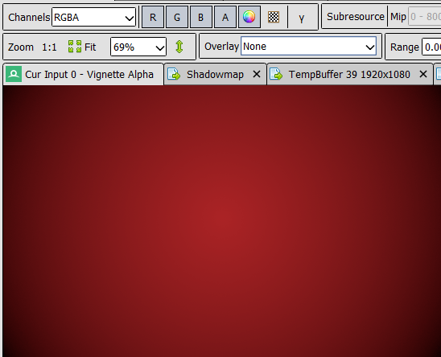

# Разбор рендеринга в игре Miside с помощью RenderDoc

При выполнении задания был проведён захват и анализ кадра из игры Miside с использованием RenderDoc. В этом отчёте мы подробно разберём наиболее интересные находки, попытаемся увидеть в них изученные на лекциях приёмы и улучшить понимание работы графического пайплайна в играх

### Игровой вид снимка

## Стек вызовов
Всего за снимок происходит 1341 вызов графического API, которые можно разделить на несколько проходов и отдельные вызовы:
| Проход | Время выполнения (мс) |
|-----------------   |----------------------|
| Compute Pass #1    | 0.6 |
| Depth only Pass #1 | 0.9 |
| Depth only Pass #2 | 1.3 |
| Compute Pass #2    | 10.3 |
| Color Pass #1      | 4.2 |
| Color Pass #2      | 7.6 |
| **Общее время кадра** | **36.5** |

Сначала первый Compute Pass копирует какие-то внутренние текстуры

    

Далее выполняется Z-prepass, создающий CameraDepthTexture, которая позже будет использована для оптимизации отрисовки (Depth test)

    
    

Второй Depth-only Pass считает shadowmap сцены, который впоследствии будет использован для наложения теней

    
    
    

Уже на этих этапах можно покрутить используемые меши и при желании выгрузить куда-то себе :)

    
    

Далее во втором Compute Pass идет Multi-scale Volumetric Obscurance - Ambient Occlusion на нескольких мипах карты глубин

    
    
    

Первый Color Pass просто накладывает текстуры

    
    
    
    

    

А второй занимается постобработкой - накладывает виньетку и рисует узоры на фоне

    
    

В качестве proof-of-concept, я отредактировал шейдер виньетки

    
    

В последнюю очередь, как можно было догадаться, рисуется интерфейс, причем на текстуре видны артефакты его создания при отключении альфа-канала

    
    
    

Перед выводом делается blit текстуры, чтобы ее перевернуть (прямо как у меня в 3-ей домашке!)

    
    

Таким образом, на примере этой простой сцены можно продемонстрировать возможности применения RenderDoc и лучше разобраться с тонкостями рендеринга